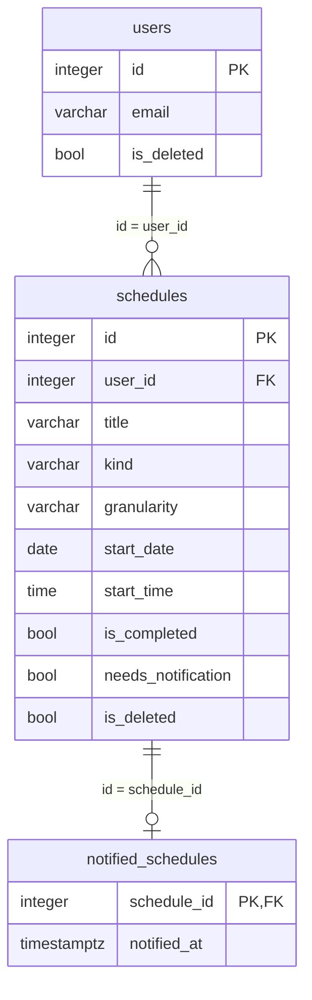

# DB設計: mail-notice（メール通知）

## 概要

この機能が使うスキーマとテーブルの範囲。`requirements.md` の該当 REQ を満たすことだけを書く。

- スキーマ: `mail_notice`。通知済みの記録だけを置く。
- ユーザはスキーマ `public`、スケジュールはスキーマ `schedule` を読む。複製しない。列は増やさない。表の作成はそれぞれ `portal` と `schedule` が担う。
- セッション、システム設定、機能マスタ、メニュー割当は使わない。
- ログはファイルへ出す。テーブルには置かない。

関連ドキュメント:

- 全体設計: `design.md`
- UI設計: `ui-design.md`
- API設計: `api-design.md`

## ER図

mermaid の erDiagram は `boolean` を型として書くとパースが壊れる。図の中だけ `bool` と書く。実体の型はテーブル設計どおり `boolean` である。

## テーブル設計

### mail_notice.notified_schedules

目的: メール送信に成功したスケジュールの記録。1 スケジュールにつき 1 行。送信成功したときだけ追加する。

| カラム | 型 | NULL | 既定 | 説明 |
|--------|-----|------|------|------|
| `schedule_id` | integer | NOT NULL | - | 通知したスケジュール。`schedule.schedules.id`。PK |
| `notified_at` | timestamptz | NOT NULL | 現在時刻 | 送信に成功した日時 |

制約:

- 主キー: `schedule_id`
- 一意: 主キーに同じ
- 外部キー: `schedule_id` → `schedule.schedules.id`（ON DELETE RESTRICT）

インデックス:

- 主キーに付随

本機能の扱い:

- 送信成功後に 1 行追加する。既にある `schedule_id` は追加しない。
- 参照して、通知済みかどうかを判定する。
- 更新しない。物理削除しない。
- チェック対象外（開始日が下限以前）や送信しなかった件は行を作らない。

### public.users（参照のみ）

目的: 所有者のメールアドレスと論理削除。本機能は参照のみ。列は増やさない。定義の正は `portal` / `user-management` の DB 設計である。

| カラム | 型 | NULL | 既定 | 説明 |
|--------|-----|------|------|------|
| `id` | integer | NOT NULL | シーケンス | ユーザID。PK |
| `email` | varchar(255) | NOT NULL | `''` | メールアドレス。空なら送らない |
| `is_deleted` | boolean | NOT NULL | false | 論理削除なら true。true なら送らない |

本機能の扱い: `id` がスケジュールの `user_id` の行を読む。追加・更新・削除はしない。`password_hash` は読まない。

### schedule.schedules（参照のみ）

目的: 通知判定の対象。本機能は参照のみ。列は増やさない。通知済みを表す列は追加しない。定義の正は `schedule` の DB 設計である。

| カラム | 型 | NULL | 既定 | 説明 |
|--------|-----|------|------|------|
| `id` | integer | NOT NULL | シーケンス | PK |
| `user_id` | integer | NOT NULL | - | 所有者。`public.users.id` |
| `title` | varchar(255) | NOT NULL | - | タイトル。メールに含める |
| `kind` | varchar(16) | NOT NULL | - | `event`（予定）または `todo`（TODO） |
| `granularity` | varchar(16) | NOT NULL | - | `day`（日単位）または `time`（時間単位） |
| `start_date` | date | NOT NULL | - | 開始日。日本標準時。下限との比較と開始日時に使う |
| `start_time` | time | NULL | - | 開始時刻（分まで）。日単位は NULL。時間単位の開始日時に使う |
| `is_completed` | boolean | NULL | - | TODO の実施済み。予定は NULL。TODO の対象判定に使う |
| `needs_notification` | boolean | NOT NULL | false | 通知要なら true |
| `is_deleted` | boolean | NOT NULL | false | 論理削除なら true。true なら対象にしない |

本機能の扱い:

- 未削除かつ通知要のうち、開始日が下限より後の行を読む。
- TODO は `is_completed = false` も条件にする。予定は `is_completed` を条件にしない。
- 追加・更新・削除はしない。

## 関連

- `users` 1 対 多 `schedules`。本機能はどちらも物理削除しない。更新しない。
- `schedules` 1 対 0..1 `notified_schedules`。送信成功したときだけ 1 行ある。スケジュールの論理削除では通知済み行を残す。スケジュールは物理削除しない。
- 本機能が物理削除する行は無い。

## 要件トレーサビリティ

| 要件 | 設計 |
|------|------|
| REQ-001 | テーブルは判定・送信の記録用。画面用の表は無い |
| REQ-002 | `schedule.schedules` と `public.users` の参照のみ。列は増やさない |
| REQ-003 | `mail_notice.notified_schedules`。`schedule_id` 一意 |
| REQ-004 | `schedule.schedules` の TODO 条件（`kind`、`is_deleted`、`needs_notification`、`is_completed`、`start_date` / `start_time`）。未通知は `notified_schedules` に無いこと |
| REQ-005 | `schedule.schedules` の予定条件。`is_completed` は見ない |
| REQ-006 | `start_date` / `start_time`。余裕分数と日単位みなし時刻はテーブルに置かない（`.env`） |
| REQ-007 | `public.users.email`。SMTP はテーブルに置かない（`.env`） |
| REQ-008 | `public.users.email` が空、または `is_deleted`。行は `notified_schedules` に作らない |
| REQ-009 | 送信失敗時は `notified_schedules` に追加しない |
| REQ-010 | `notified_schedules` が無い行は、再起動後も対象になり得る |
| REQ-011 | ログはファイル。テーブルに置かない |
| REQ-012 | `schedule.schedules.start_date` と下限の比較。遡及日数はテーブルに置かない（`.env`）。対象外は `notified_schedules` に作らない |

## 未決事項

- なし

## 承認

現在の状態: 承認済み

| 日時 | 状態 | 変更概要 |
|------|------|----------|
| 2026-08-31 23:32 | 未承認 | 初版 |
| 2026-08-31 23:34 | 承認済み | `mail_notice.notified_schedules` と参照のみの `users` / `schedules` を承認 |
