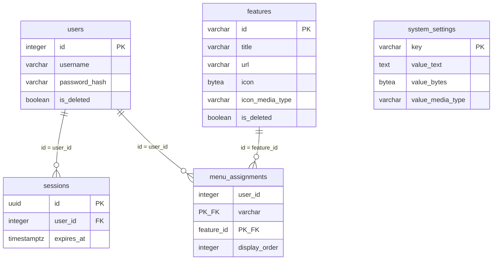

# DB設計: portal（ログインとメニュー）

## 概要

この機能が使うスキーマとテーブルの範囲。`requirements.md` の該当 REQ を満たすことだけを書く。

本機能の固有スキーマは作らない。ユーザ、セッション、システム設定、機能マスタ、メニュー割当はスキーマ `public` に置く。機能スキーマへ複製しない。後続の Web 管理機能も同じ表を使う。

関連ドキュメント:

- 全体設計: `design.md`
- UI設計: `ui-design.md`
- API設計: `api-design.md`

## ER図

## テーブル設計

### public.users

目的: ログインに使うユーザ。パスワードはハッシュのみ保持する。論理削除する。

| カラム | 型 | NULL | 既定 | 説明 |
|--------|-----|------|------|------|
| `id` | integer | NOT NULL | シーケンス | ユーザID。PK |
| `username` | varchar(255) | NOT NULL | - | ユーザ名。ログインに使う |
| `password_hash` | varchar(255) | NOT NULL | - | パスワードのハッシュ。平文は置かない |
| `is_deleted` | boolean | NOT NULL | false | 論理削除なら true |

制約:

- 主キー: `id`
- 一意: `username`（論理削除済みも含め、同じユーザ名は置けない）
- 外部キー: なし

インデックス:

- `username`（一意制約に付随）

### public.sessions

目的: ログイン状態。Cookie に載せるセッション ID と、期限を保持する。

| カラム | 型 | NULL | 既定 | 説明 |
|--------|-----|------|------|------|
| `id` | uuid | NOT NULL | 生成した UUID | セッション ID。PK。Cookie の値 |
| `user_id` | integer | NOT NULL | - | 対象ユーザ。`users.id` |
| `expires_at` | timestamptz | NOT NULL | - | この日時を過ぎたら未ログイン |

制約:

- 主キー: `id`
- 一意: なし
- 外部キー: `user_id` → `public.users.id`（ON DELETE RESTRICT）

インデックス:

- `user_id`
- `expires_at`

期限は分単位の `SESSION_TIMEOUT_MINUTES` から算出する。利用のたびに `expires_at` を延ばしてよい。ログアウトと、ユーザの論理削除時は当該行を削除する。

### public.system_settings

目的: 機能をまたいで参照する値。ログイン URL、メニュー URL、システム共通アイコン。

| カラム | 型 | NULL | 既定 | 説明 |
|--------|-----|------|------|------|
| `key` | varchar(64) | NOT NULL | - | 設定キー。PK |
| `value_text` | text | NULL | - | URL など文字列の値 |
| `value_bytes` | bytea | NULL | - | アイコンのバイナリ。ディスク上のファイルは持たない |
| `value_media_type` | varchar(64) | NULL | - | バイナリのメディアタイプ。例: `image/png`, `image/jpeg`。文字列の設定では NULL |

制約:

- 主キー: `key`
- 一意: なし
- 外部キー: なし
- 検査: `value_text` と `value_bytes` のうち、ちょうど一方だけが NOT NULL
- 検査: `value_bytes` があるとき `value_media_type` は NOT NULL。`value_text` があるとき `value_media_type` は NULL

インデックス:

- なし（PK のみ）

初期データ（必須キー）:

| key | 使う列 | 内容 |
|-----|--------|------|
| `login_url` | `value_text` | ログイン画面の URL（パス `/portal/login` に対応） |
| `menu_url` | `value_text` | メニュー画面の URL（パス `/portal/menu` に対応） |
| `icon_system` | `value_bytes` + `value_media_type` | システム全体を表すアイコン |
| `icon_settings` | `value_bytes` + `value_media_type` | 設定アイコン |
| `icon_back` | `value_bytes` + `value_media_type` | 戻るアイコン |

URL のホストは環境に合わせて登録する。アイコンは画像のバイト列とメディアタイプを登録する。HTTP や JSON への載せ方（`Content-Type` 付きのバイナリ応答、data URL 文字列など）は `api-design.md` で決める。DB には Base64 や data URL としては置かない。

### public.features

目的: 機能マスタ。他機能が利用可否を判定するときの識別子を PK にする。論理削除する。

| カラム | 型 | NULL | 既定 | 説明 |
|--------|-----|------|------|------|
| `id` | varchar(64) | NOT NULL | - | 機能ID。運用者が指定する。PK。他機能が参照するキー |
| `title` | varchar(255) | NOT NULL | - | メニューに出すタイトル |
| `url` | varchar(2048) | NOT NULL | - | 遷移先 URL |
| `icon` | bytea | NOT NULL | - | 機能を表すアイコンのバイナリ。無いときは空。ディスク上のファイルは持たない |
| `icon_media_type` | varchar(64) | NOT NULL | - | アイコンのメディアタイプ。無いときは空。例: `image/png`, `image/jpeg` |
| `is_deleted` | boolean | NOT NULL | false | 論理削除なら true |

制約:

- 主キー: `id`
- 一意: なし（PK が識別子）
- 外部キー: なし

インデックス:

- なし（PK のみ）

論理削除済みも含め、同じ `id` は置けない。

### public.menu_assignments

目的: ユーザのメニューに載せる機能と表示順。

| カラム | 型 | NULL | 既定 | 説明 |
|--------|-----|------|------|------|
| `user_id` | integer | NOT NULL | - | 対象ユーザ。`users.id` |
| `feature_id` | varchar(64) | NOT NULL | - | 対象機能。`features.id` |
| `display_order` | integer | NOT NULL | - | 表示順。値が小さいほど先 |

制約:

- 主キー: `(user_id, feature_id)`
- 一意: なし（同じユーザで `display_order` が同じになってよい。そのときは `feature_id` で順を安定させる）
- 外部キー: `user_id` → `public.users.id`（ON DELETE RESTRICT）
- 外部キー: `feature_id` → `public.features.id`（ON DELETE RESTRICT）

インデックス:

- `(user_id, display_order)`

割当の解除は行を削除する。ユーザまたは機能の論理削除では行を残す。メニュー表示と利用可否判定では、`users.is_deleted = false` かつ `features.is_deleted = false` のときだけ有効とする。

## 関連

- `users` 1 対 多 `sessions`。ユーザを物理削除しない。論理削除時は、そのユーザの `sessions` を削除する。
- `users` 1 対 多 `menu_assignments`。ユーザの論理削除では割当行を残す。
- `features` 1 対 多 `menu_assignments`。機能の論理削除では割当行を残す。
- `system_settings` は他表と結び付けない。
- 物理削除するのはセッション行と、割当解除時の `menu_assignments` 行だけである。

## 要件トレーサビリティ

| 要件 | 設計 |
|------|------|
| REQ-001 | `public.users`（`username`, `password_hash`） |
| REQ-002 | `public.users.is_deleted` |
| REQ-003 | `public.sessions` |
| REQ-004 | `public.system_settings` の初期キー 5 件 |
| REQ-005 | `public.features.icon` と `icon_media_type`、`public.system_settings.value_bytes` と `value_media_type` |
| REQ-006 | `public.users`、`public.sessions` |
| REQ-007 | `public.users.is_deleted` と `password_hash` の照合 |
| REQ-008 | `public.sessions` の行削除 |
| REQ-009 | `public.sessions`（行が無い／期限切れは未ログイン） |
| REQ-010 | `public.features` |
| REQ-011 | `public.menu_assignments` |
| REQ-012 | `public.menu_assignments` と未削除の `public.features` |
| REQ-013 | `public.features.url` |
| REQ-014 | `public.features`、`public.menu_assignments`（スキーマ `public`） |
| REQ-015 | `public.users`（`is_deleted = false`） |
| REQ-016 | `public.users` への挿入 |
| REQ-017 | `public.users.is_deleted` |
| REQ-018 | `public.features` の挿入・更新・論理削除 |
| REQ-019 | `public.menu_assignments` の挿入・削除 |

## 未決事項

-

## 承認

現在の状態: 未承認

| 日時 | 状態 | 変更概要 |
|------|------|----------|
| 2026-08-26 08:41 | 未承認 | 初版 |
| 2026-08-26 08:46 | 未承認 | アイコンにメディアタイプ列を追加。DB はバイナリで保持する |
| 2026-08-26 08:47 | 承認済み | メディアタイプ列を含む DB 設計を承認 |
| 2026-08-26 23:40 | 未承認 | 機能アイコンを空（なし）にできるようにする |
| 2026-08-26 23:45 | 承認済み | 機能アイコンなしを承認 |
| 2026-08-29 17:15 | 未承認 | 初期 URL を `/portal/login` と `/portal/menu` に合わせる |
