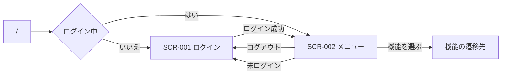

# UI設計: portal（ログインとメニュー）

## 概要

この機能の画面構成と、画面毎の部品配置。`requirements.md` の該当 REQ を満たすことだけを書く。運用コマンドは画面を持たない。

起動・モジュール構成は `design.md`、API の契約は `api-design.md`、テーブル定義は `db-design.md` に書く。

色・余白・部品の見た目は `.cursor/rules/15-ui-style.mdc` のトークンに合わせる。ヘッダ / ナビの殻は使わない。配置は本ファイルに従う。他機能の画面は参照しない。`--color-primary` は Cyan `#3EE0C8`。

関連ドキュメント:

- 全体設計: `design.md`
- DB設計: `db-design.md`
- API設計: `api-design.md`

## 共通UI

ログイン画面とメニュー画面は、ヘッダ / ナビの殻を置かない。システムアイコンは本機能の画面では出さない。

設定アイコンと戻るアイコンは保持するが、本機能の画面では使わない（設定画面は対象外。戻るは各機能側で用いる）。

## 画面一覧

| 画面ID | 画面名 | パス | 目的 | 対応 REQ |
|--------|--------|------|------|----------|
| SCR-001 | ログイン | `/login` | ユーザ名とパスワードでログインする。 | REQ-006, REQ-007, REQ-009 |
| SCR-002 | メニュー | `/menu` | 割り当てられた機能を示し、遷移とログアウトを行う。 | REQ-004, REQ-005, REQ-006, REQ-008, REQ-012, REQ-013 |

パス `/` は画面を持たず、ログイン中なら SCR-002、未ログインなら SCR-001 へ進む。

## 画面詳細

### SCR-001 ログイン

- パス: `/login`
- 目的: ユーザ名とパスワードを入力してログインする。
- 対応 REQ: REQ-006, REQ-007, REQ-009

#### レイアウト

ヘッダとナビは置かない。画面中央に、ユーザ名、パスワード、ログインボタンだけを置く。

| 領域 | 部品 | 内容・動作 |
|------|------|------------|
| メイン | エラー | 認証失敗時、入力欄の上に「ログインできませんでした」。ユーザ名の有無は示さない。 |
| メイン | ユーザ名 | テキスト入力。ラベルは出さず、プレースホルダは「ユーザ名」。 |
| メイン | パスワード | パスワード入力。ラベルは出さず、プレースホルダは「パスワード」。入力は伏せる。 |
| メイン | ボタン | 「ログイン」。空欄があるときは送らない。成功時は SCR-002 へ進む。 |

#### 部品詳細

| 部品 | 必須 | 初期値 | バリデーション | 備考 |
|------|------|--------|----------------|------|
| ユーザ名 | 必須 | 空 | 空なら送信しない | プレースホルダ「ユーザ名」 |
| パスワード | 必須 | 空 | 空なら送信しない | プレースホルダ「パスワード」。入力は伏せる |
| ボタン「ログイン」 | - | - | - | 読込中は無効 |
| エラー | - | 非表示 | - | 失敗時のみ。詳細理由は出さない |

#### 操作

| 操作 | 部品 | 結果 |
|------|------|------|
| ログイン | ボタン「ログイン」 | 入力が空なら送信せず、対象欄を示す。成功なら SCR-002。失敗ならエラーを示し、入力は残す。 |
| 確定（Enter） | ユーザ名 / パスワード | ボタン「ログイン」と同じ。 |

#### 状態

| 状態 | 表示 |
|------|------|
| 初期 | 入力は空。エラーは出さない。ログイン操作は可能。 |
| 読込中 | 「読み込み中…」。入力とボタンは無効。 |
| 空 | なし（入力フォームのため） |
| エラー | 入力欄の上に「ログインできませんでした」。操作は可能。 |

#### レスポンシブ

殻は使わない。入力欄は PC / スマートフォンとも単一カラム。

### SCR-002 メニュー

- パス: `/menu`
- 目的: ログイン中ユーザに割り当てられた機能を表示順で示し、遷移先へ進む。ログアウトできる。
- 対応 REQ: REQ-004, REQ-005, REQ-006, REQ-008, REQ-012, REQ-013

#### レイアウト

ヘッダとナビは置かない。割り当て機能はカードとして並べる。ログアウトは画面上のテキストボタンとする。

| 領域 | 部品 | 内容・動作 |
|------|------|------------|
| メイン | テキストボタン | ログアウト。実行後は SCR-001 へ進む。 |
| メイン | エラー | 取得失敗時、領域先頭にエラーメッセージ。 |
| メイン | カード | 機能 1 件につき 1 枚。タイトルを示す。アイコンがあるときは画像も示す。押すとその機能の遷移先へ進む。 |

ページ全体はスクロールしない。カードが多いときは一覧領域だけスクロールする。

#### 部品詳細

| 部品 | 必須 | 初期値 | バリデーション | 備考 |
|------|------|--------|----------------|------|
| カード（機能） | - | 割当なしなら 0 件 | - | 表示順どおり。アイコンがあるときはデータとして得た画像。無いときは画像を出さない。ディスク上のファイルは使わない |
| テキストボタン「ログアウト」 | - | - | - | 読込中は無効 |
| エラー | - | 非表示 | - | 取得失敗時のみ |

#### 操作

| 操作 | 部品 | 結果 |
|------|------|------|
| 機能を選ぶ | カード | その機能の遷移先 URL へ進む。 |
| ログアウト | テキストボタン「ログアウト」 | ログイン状態を終え、SCR-001 へ進む。 |

未ログインで本画面を開いたときは、内容を見せず SCR-001 へ進む。

#### 状態

| 状態 | 表示 |
|------|------|
| 初期 | メニュー取得を開始する。 |
| 読込中 | 中央に「読み込み中…」。カード操作とログアウトは無効。 |
| 空 | 「データがありません」。ログアウトは可能。 |
| エラー | 領域先頭にエラーメッセージ。再操作は可能なら維持。未ログインはエラー表示せず SCR-001 へ進む。 |

#### レスポンシブ

殻は使わない。機能カードは、PC では複数列、スマートフォンでは単一列。

## 画面遷移

| 起点 | 操作 | 条件 | 行き先 |
|------|------|------|--------|
| `/` | 開く | 未ログイン | SCR-001 |
| `/` | 開く | ログイン中 | SCR-002 |
| SCR-001 | ログイン | 成功 | SCR-002 |
| SCR-001 | ログイン | 失敗または入力空 | SCR-001（残留） |
| SCR-002 | 開く | 未ログイン | SCR-001 |
| SCR-002 | ログアウト | なし | SCR-001 |
| SCR-002 | 機能を選ぶ | なし | その機能の遷移先 URL |

## 要件トレーサビリティ

| 要件 | 設計 |
|------|------|
| REQ-001 | 画面対象外（運用コマンド） |
| REQ-002 | 画面対象外（運用コマンド）。ログイン失敗として SCR-001 が扱う |
| REQ-003 | 画面対象外（セッション）。フロントはセッション ID を持たない |
| REQ-004 | 画面では出さない（システム設定として保持。GET `/settings`） |
| REQ-005 | SCR-002 の機能カード |
| REQ-006 | SCR-001 → SCR-002 |
| REQ-007 | SCR-001 のエラー表示 |
| REQ-008 | SCR-002 のログアウト |
| REQ-009 | SCR-002 を未ログインで開いたときの SCR-001 へ |
| REQ-010 | 画面対象外（運用コマンド） |
| REQ-011 | 画面対象外（運用コマンド） |
| REQ-012 | SCR-002 のカード一覧 |
| REQ-013 | SCR-002 のカード選択 |
| REQ-014 | 画面対象外（共通データ。他機能が参照） |
| REQ-015 | 画面対象外（運用コマンド） |
| REQ-016 | 画面対象外（運用コマンド） |
| REQ-017 | 画面対象外（運用コマンド） |
| REQ-018 | 画面対象外（運用コマンド） |
| REQ-019 | 画面対象外（運用コマンド） |

## 未決事項

-

## 承認

現在の状態: 承認済み

| 日時 | 状態 | 変更概要 |
|------|------|----------|
| 2026-08-26 08:35 | 未承認 | 初版 |
| 2026-08-26 08:39 | 未承認 | レスポンシブの「殻は 15」を、PC/スマートフォンの画面分割の説明に改めた |
| 2026-08-26 08:40 | 承認済み | 改訂後の画面設計を承認 |
| 2026-08-26 10:40 | 未承認 | ログインとメニューを 15 の殻の対象外に。ログインは入力とボタンのみ、ガイドはプレースホルダ |
| 2026-08-26 10:46 | 承認済み | 殻を使わない改訂を承認 |
| 2026-08-26 11:10 | 未承認 | 見た目を近未来トークン（暗面・アクセント光）に合わせる |
| 2026-08-26 11:36 | 承認済み | 近未来トークンへの改訂を承認 |
| 2026-08-26 23:40 | 未承認 | アイコンなしの機能はタイトルのみ示す |
| 2026-08-26 23:45 | 承認済み | アイコンなしはタイトルのみ示す改訂を承認 |
