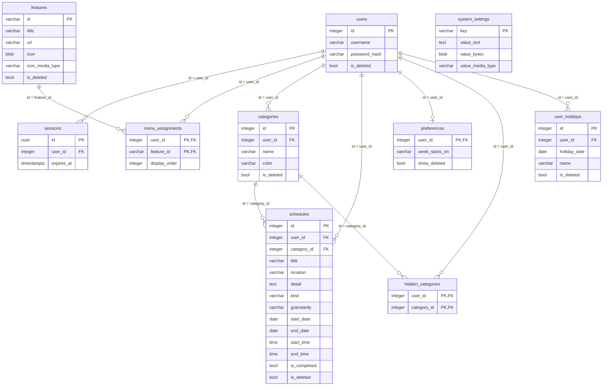

# DB設計: schedule（スケジュール管理）

## 概要

この機能が使うスキーマとテーブルの範囲。`requirements.md` の該当 REQ を満たすことだけを書く。

- スキーマ: `schedule`。カテゴリ、スケジュール、ユーザ休日、表示設定を置く。
- ユーザ、セッション、システム設定、機能マスタ、メニュー割当はスキーマ `public` を読む。複製しない。列は増やさない。表の作成は `portal` が担う。
- 日本の祝日は算出し、テーブルには置かない。ユーザ休日はテーブルに置く。
- ログはファイルへ出す。テーブルには置かない。

関連ドキュメント:

- 全体設計: `design.md`
- UI設計: `ui-design.md`
- API設計: `api-design.md`

## ER図

mermaid の erDiagram は `boolean` と `bytea` を型として書くとパースが壊れる。図の中だけ `bool` / `blob` と書く。実体の型はテーブル設計どおり `boolean` / `bytea` である。

## テーブル設計

### schedule.categories

目的: 利用者本人のカテゴリ。名称と色を持つ。論理削除する。

| カラム | 型 | NULL | 既定 | 説明 |
|--------|-----|------|------|------|
| `id` | integer | NOT NULL | シーケンス | PK |
| `user_id` | integer | NOT NULL | - | 所有者。`public.users.id` |
| `name` | varchar(255) | NOT NULL | - | 名称。空は置かない |
| `color` | varchar(7) | NOT NULL | - | 色。`#` に続く 6 桁の 16 進（例: `#4DA3FF`） |
| `is_deleted` | boolean | NOT NULL | false | 論理削除なら true |

制約:

- 主キー: `id`
- 一意: `(user_id, name)` のうち `is_deleted = false` の行だけ（部分一意。論理削除済み同士、および削除済みと同じ名称の未削除は可）
- 外部キー: `user_id` → `public.users.id`（ON DELETE RESTRICT）
- 検査: `char_length(name) > 0`
- 検査: `color` は `#` + 16 進 6 桁

インデックス:

- `(user_id)` のうち `is_deleted = false`
- 部分一意に付随する `(user_id, name)` WHERE `is_deleted = false`

同一ユーザの未削除で名称が重複する挿入・更新は失敗する。他ユーザや論理削除済みと同じ名称は置ける。物理削除はしない。紐づくスケジュールは残し、`category_id` は変えない。

### schedule.schedules

目的: 利用者本人の予定と TODO。論理削除する。

| カラム | 型 | NULL | 既定 | 説明 |
|--------|-----|------|------|------|
| `id` | integer | NOT NULL | シーケンス | PK |
| `user_id` | integer | NOT NULL | - | 所有者。`public.users.id` |
| `category_id` | integer | NOT NULL | - | カテゴリ。`schedule.categories.id` |
| `title` | varchar(255) | NOT NULL | - | タイトル。空は置かない |
| `location` | varchar(255) | NULL | - | 場所。空は NULL |
| `detail` | text | NULL | - | 詳細。空は NULL |
| `kind` | varchar(16) | NOT NULL | - | `event`（予定）または `todo`（TODO） |
| `granularity` | varchar(16) | NOT NULL | - | `day`（日単位）または `time`（時間単位） |
| `start_date` | date | NOT NULL | - | 開始日。日本標準時の年月日 |
| `end_date` | date | NOT NULL | - | 終了日。日本標準時の年月日 |
| `start_time` | time | NULL | - | 開始時刻（分まで）。日単位は NULL。秒は持たない |
| `end_time` | time | NULL | - | 終了時刻（分まで）。日単位は NULL。秒は持たない |
| `is_completed` | boolean | NULL | - | TODO の実施済み。予定は NULL。TODO は NOT NULL |
| `is_deleted` | boolean | NOT NULL | false | 論理削除なら true |

制約:

- 主キー: `id`
- 一意: なし
- 外部キー: `user_id` → `public.users.id`（ON DELETE RESTRICT）
- 外部キー: `category_id` → `schedule.categories.id`（ON DELETE RESTRICT）
- 検査: `char_length(title) > 0`
- 検査: `kind IN ('event', 'todo')`
- 検査: `granularity IN ('day', 'time')`
- 検査: `granularity = 'day'` のとき `start_time` と `end_time` は NULL。`granularity = 'time'` のとき両方 NOT NULL
- 検査: `kind = 'event'` のとき `is_completed` は NULL。`kind = 'todo'` のとき `is_completed` は NOT NULL
- 検査: `end_date > start_date`、または `end_date = start_date` かつ（日単位、または `end_time >= start_time`）

インデックス:

- `(user_id, start_date, end_date)` のうち `is_deleted = false`（期間の重なり検索）
- `(user_id, category_id)` のうち `is_deleted = false`

期間の重なりは `start_date <= 範囲終了日 AND end_date >= 範囲開始日`。並びは `granularity`（`day` が先）、`start_date`、`start_time`（NULL 先）、`end_date`、`end_time`（NULL 先）、`title`。

追加時、`kind = 'todo'` なら `is_completed = false`。予定から TODO に変えるときは `is_completed = false`。TODO から予定に変えるときは `is_completed = NULL`。

`category_id` は、追加および更新では本人の未削除カテゴリだけを指定できる。削除済みカテゴリが付いた既存行は残してよい（カテゴリ論理削除時に `category_id` は変えない）。

`user_id` はカテゴリの `user_id` と一致させる（本人のカテゴリだけ）。物理削除はしない。

時刻は日本標準時として解釈する。タイムゾーン付き型は使わない。

### schedule.preferences

目的: 利用者本人の表示設定。行が無いときは初期値として扱う。

| カラム | 型 | NULL | 既定 | 説明 |
|--------|-----|------|------|------|
| `user_id` | integer | NOT NULL | - | 所有者。PK。`public.users.id` |
| `week_starts_on` | varchar(16) | NOT NULL | `'sunday'` | `sunday`（日曜始まり）または `monday`（月曜始まり） |
| `show_deleted` | boolean | NOT NULL | false | 削除済みカテゴリを一覧に出すなら true |

制約:

- 主キー: `user_id`
- 一意: なし（PK のみ）
- 外部キー: `user_id` → `public.users.id`（ON DELETE RESTRICT）
- 検査: `week_starts_on IN ('sunday', 'monday')`

インデックス:

- なし（PK のみ）

行が無いときの扱い: 週の開始は日曜始まり、削除済みカテゴリは出さない。初回の更新で行を作る。物理削除はしない。

### schedule.hidden_categories

目的: 利用者が非表示にしたカテゴリ。行があるカテゴリをカレンダーに出さない。行が無いカテゴリは表示する。

| カラム | 型 | NULL | 既定 | 説明 |
|--------|-----|------|------|------|
| `user_id` | integer | NOT NULL | - | 所有者。`public.users.id` |
| `category_id` | integer | NOT NULL | - | 非表示にするカテゴリ。`schedule.categories.id` |

制約:

- 主キー: `(user_id, category_id)`
- 一意: なし（PK のみ）
- 外部キー: `user_id` → `public.users.id`（ON DELETE RESTRICT）
- 外部キー: `category_id` → `schedule.categories.id`（ON DELETE RESTRICT）

インデックス:

- `(user_id)`

非表示を解除するときは行を削除する。カテゴリの論理削除では行を残してよい。`category_id` は本人のカテゴリに限る（`categories.user_id` と一致）。

### schedule.user_holidays

目的: 利用者本人が登録する休日。年月日と名称を持つ。日本の祝日とは別に保持する。論理削除する。

| カラム | 型 | NULL | 既定 | 説明 |
|--------|-----|------|------|------|
| `id` | integer | NOT NULL | シーケンス | PK |
| `user_id` | integer | NOT NULL | - | 所有者。`public.users.id` |
| `holiday_date` | date | NOT NULL | - | 年月日。日本標準時の日付 |
| `name` | varchar(255) | NOT NULL | - | 名称。空は置かない |
| `is_deleted` | boolean | NOT NULL | false | 論理削除なら true |

制約:

- 主キー: `id`
- 一意: `(user_id, holiday_date)` のうち `is_deleted = false` の行だけ（部分一意。論理削除済み同士、および削除済みと同じ年月日の未削除は可）
- 外部キー: `user_id` → `public.users.id`（ON DELETE RESTRICT）
- 検査: `char_length(name) > 0`

インデックス:

- `(user_id, holiday_date)` のうち `is_deleted = false`
- 部分一意に付随する `(user_id, holiday_date)` WHERE `is_deleted = false`

同一ユーザの未削除で年月日が重複する挿入・更新は失敗する。他ユーザや論理削除済みと同じ年月日は置ける。日本の祝日と同じ年月日も置ける。物理削除はしない。一覧は未削除のみ、`holiday_date` の昇順。

### public.users

目的: ログインに使うユーザ。本機能は読取のみ（追加・更新・論理削除はしない）。

| カラム | 型 | NULL | 既定 | 説明 |
|--------|-----|------|------|------|
| `id` | integer | NOT NULL | シーケンス | ユーザID。PK。業務行の `user_id` |
| `username` | varchar(255) | NOT NULL | - | ユーザ名 |
| `password_hash` | varchar(255) | NOT NULL | - | パスワードのハッシュ。本機能は使わない |
| `is_deleted` | boolean | NOT NULL | false | 論理削除なら true |

制約:

- 主キー: `id`
- 一意: `username`
- 外部キー: なし

インデックス:

- `username`（一意制約に付随）

本機能の扱い: セッションから特定したユーザが `is_deleted = false` のときだけ許可する。`password_hash` は読まない。列は増やさない。

### public.sessions

目的: ログイン状態。本機能は参照のみ（作成・ログアウトはしない）。

| カラム | 型 | NULL | 既定 | 説明 |
|--------|-----|------|------|------|
| `id` | uuid | NOT NULL | 生成した UUID | セッション ID。PK。Cookie の値 |
| `user_id` | integer | NOT NULL | - | 対象ユーザ。`users.id` |
| `expires_at` | timestamptz | NOT NULL | - | この日時を過ぎたら未ログイン |

制約:

- 主キー: `id`
- 一意: なし
- 外部キー: `user_id` → `public.users.id`（ON DELETE RESTRICT）

インデックス:

- `user_id`
- `expires_at`

本機能の扱い: 行が無い、期限切れ、対象ユーザが論理削除済みは未ログイン。利用のたびに `expires_at` を延ばしてよい。期限は `SESSION_TIMEOUT_MINUTES` から算出する。セッションの新規作成と破棄はしない。

### public.system_settings

目的: 機能をまたいで参照する値。本機能は読むだけ（変更しない）。

| カラム | 型 | NULL | 既定 | 説明 |
|--------|-----|------|------|------|
| `key` | varchar(64) | NOT NULL | - | 設定キー。PK |
| `value_text` | text | NULL | - | URL など文字列の値 |
| `value_bytes` | bytea | NULL | - | アイコンのバイナリ |
| `value_media_type` | varchar(64) | NULL | - | バイナリのメディアタイプ |

制約:

- 主キー: `key`
- 一意: なし
- 外部キー: なし

インデックス:

- なし（PK のみ）

本機能が読むキー:

| key | 使う列 | 用途 |
|-----|--------|------|
| `login_url` | `value_text` | 未ログイン時の誘導先 |
| `menu_url` | `value_text` | 戻る先 |
| `icon_system` | `value_bytes` + `value_media_type` | ヘッダのシステムアイコン |
| `icon_back` | `value_bytes` + `value_media_type` | ヘッダの戻るアイコン |

`icon_settings` は本機能の画面では使わない。

### public.features

目的: 機能マスタ。本機能は識別子 `schedule` の行を読んで利用可否を判定する。更新しない。

| カラム | 型 | NULL | 既定 | 説明 |
|--------|-----|------|------|------|
| `id` | varchar(64) | NOT NULL | - | 機能ID。PK |
| `title` | varchar(255) | NOT NULL | - | タイトル |
| `url` | varchar(2048) | NOT NULL | - | 遷移先 URL |
| `icon` | bytea | NOT NULL | - | アイコン |
| `icon_media_type` | varchar(64) | NOT NULL | - | メディアタイプ |
| `is_deleted` | boolean | NOT NULL | false | 論理削除なら true |

制約:

- 主キー: `id`
- 一意: なし
- 外部キー: なし

インデックス:

- なし（PK のみ）

本機能の扱い: `id = 'schedule'` かつ `is_deleted = false` のときだけ利用を許可する。

### public.menu_assignments

目的: ユーザのメニューに載せる機能。本機能は、操作中ユーザに `schedule` が割り当てられているかの判定に使う。更新しない。

| カラム | 型 | NULL | 既定 | 説明 |
|--------|-----|------|------|------|
| `user_id` | integer | NOT NULL | - | 対象ユーザ。`users.id` |
| `feature_id` | varchar(64) | NOT NULL | - | 対象機能。`features.id` |
| `display_order` | integer | NOT NULL | - | 表示順 |

制約:

- 主キー: `(user_id, feature_id)`
- 一意: なし
- 外部キー: `user_id` → `public.users.id`（ON DELETE RESTRICT）
- 外部キー: `feature_id` → `public.features.id`（ON DELETE RESTRICT）

インデックス:

- `(user_id, display_order)`

本機能の扱い: `user_id` が操作中ユーザ、`feature_id = 'schedule'`、かつユーザと機能が未削除のときだけ許可する。

## 関連

- `users` 1 対 多 `categories`。ユーザを物理削除しない。カテゴリも物理削除しない。
- `users` 1 対 多 `schedules`。スケジュールは物理削除しない。
- `users` 1 対 0..1 `preferences`。行が無いときは初期値。
- `users` 1 対 多 `hidden_categories`。非表示解除時だけ行を削除する。
- `users` 1 対 多 `user_holidays`。ユーザ休日は物理削除しない。
- `categories` 1 対 多 `schedules`。カテゴリの論理削除ではスケジュール行を残し、`category_id` は維持する。
- `categories` 1 対 多 `hidden_categories`。カテゴリの論理削除では非表示行を残してよい。
- `users` 1 対 多 `sessions`。本機能はセッション行を削除しない。
- `users` 1 対 多 `menu_assignments`。本機能は割当行を変更しない。
- 本機能が物理削除するのは、非表示を解除するときの `hidden_categories` 行だけである。

## 要件トレーサビリティ

| 要件 | 設計 |
|------|------|
| REQ-001 | `public.sessions`、`public.users`、`public.features`（`id = 'schedule'`）、`public.menu_assignments` |
| REQ-002 | `schedule.categories.user_id`、`schedule.schedules.user_id`、`schedule.preferences.user_id`、`schedule.hidden_categories.user_id`、`schedule.user_holidays.user_id` |
| REQ-003 | `schedule.schedules.kind`、`is_completed` |
| REQ-004 | `schedule.schedules` のタイトル・開始終了・カテゴリ・場所・詳細・粒度・種別 |
| REQ-005 | `granularity`、`start_date` / `end_date`、`start_time` / `end_time` |
| REQ-006 | 開始・終了の検査制約 |
| REQ-007 | `schedule.schedules` への挿入 |
| REQ-008 | `schedule.schedules` の更新（`is_deleted = false`） |
| REQ-009 | `schedule.schedules.is_deleted` |
| REQ-010 | `schedule.schedules.is_completed`（`kind = 'todo'`） |
| REQ-011 | `schedule.categories` への挿入。部分一意 `(user_id, name)` |
| REQ-012 | `schedule.categories` の `name` / `color` 更新。部分一意 |
| REQ-013 | `schedule.categories.is_deleted`。スケジュールの `category_id` は維持 |
| REQ-014 | `schedule.preferences.show_deleted` |
| REQ-015 | `schedule.hidden_categories` |
| REQ-016 | テーブルなし（表示対象月は画面状態） |
| REQ-017 | `schedule.preferences.week_starts_on` |
| REQ-018 | テーブルなし（日本の祝日は算出） |
| REQ-019 | 取得時の ORDER BY（列の組み合わせ） |
| REQ-020 | `start_date` / `end_date` による期間重なり |
| REQ-021〜REQ-026 | テーブルなし（画面） |
| REQ-027 | テーブルなし（ファイルログ） |
| REQ-028 | `schedule.user_holidays` への挿入。部分一意 `(user_id, holiday_date)` |
| REQ-029 | `schedule.user_holidays` の `holiday_date` / `name` 更新。部分一意 |
| REQ-030 | `schedule.user_holidays.is_deleted` |

## 未決事項

- なし

## 承認

現在の状態: 承認済み

| 日時 | 状態 | 変更概要 |
|------|------|----------|
| 2026-08-27 21:19 | 未承認 | 初版 |
| 2026-08-27 21:23 | 未承認 | ER図の mermaid 構文を修正。表示設定列を `show_deleted` に短縮 |
| 2026-08-27 21:40 | 未承認 | ER図の型名を mermaid 向けに `bool` / `blob` へ変更（実体の型は変えない） |
| 2026-08-27 21:46 | 未承認 | ユーザ休日テーブル `user_holidays` を追加 |
| 2026-08-27 21:55 | 承認済み | ユーザ休日を含む DB 設計を承認 | |
