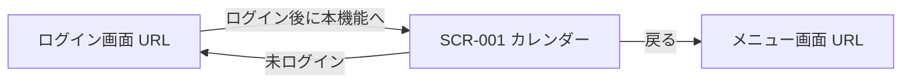

# UI設計: schedule（スケジュール管理）

## 概要

この機能の画面構成と、画面毎の部品配置。`requirements.md` の該当 REQ を満たすことだけを書く。

起動・モジュール構成は `design.md`、API の契約は `api-design.md`、テーブル定義は `db-design.md` に書く。

色・余白・部品の見た目、画面分割とナビは `.cursor/rules/15-ui-style.mdc` に従う。コンテンツ領域に置く部品は、この機能の要件に合わせて決める。他機能の画面は参照しない。`--color-primary` は Blue `#4DA3FF`。カテゴリに付ける色は利用者が選ぶ値であり、パレットの `--color-primary` とは別である。土曜日の日付は `--color-primary`、日曜日および休日（日本の祝日・ユーザ休日）の日付は `--color-danger`。休日が土曜日と重なるときは `--color-danger`。独自色は置かない。

関連ドキュメント:

- 全体設計: `design.md`
- DB設計: `db-design.md`
- API設計: `api-design.md`

## 共通UI

ヘッダとナビの形は `15-ui-style.mdc`。ログイン画面とメニュー画面は持たない。殻を使う。画面はカレンダーのみのため、ナビ項目は 1 つとする。

| 部品 | 配置箇所 | 役割 |
|------|----------|------|
| 戻る | ヘッダ | テキストボタン。戻るアイコンと「戻る」。メニュー画面 URL へ進む。 |
| 見出し | ヘッダ | 現在の画面名「カレンダー」。 |
| システムアイコン | ヘッダ | システム全体を表すアイコン。押しても遷移しない。 |
| ナビ「カレンダー」 | ナビ | SCR-001 へ。現在地を示す。 |
| スケジュール入力 | モーダル | 新規追加または編集。保存・キャンセル。編集時は削除。 |
| 残件ポップアップ | ホバー | PC の日セルで、表示しきれないスケジュールの一覧。 |
| カテゴリ入力 | モーダル | カテゴリの追加または名称・色の変更。保存・キャンセル。 |
| 休日入力 | モーダル | ユーザ休日の追加または年月日・名称の変更。保存・キャンセル。 |
| 確認ダイアログ | モーダル | スケジュール、カテゴリ、またはユーザ休日の削除確認。「削除」と「キャンセル」。 |

未ログインで画面を開いたときは、内容を見せずログイン画面 URL へ進む。本機能が割り当てられていないときは、内容を見せず、コンテンツに「この機能を使えません」と戻る操作だけを示す。

## 画面一覧

| 画面ID | 画面名 | パス | 目的 | 対応 REQ |
|--------|--------|------|------|----------|
| SCR-001 | カレンダー | `/` | 月カレンダーの表示。カテゴリとユーザ休日の操作。スケジュールの追加・編集・削除。TODO の実施状態の変更。表示設定の変更。 | REQ-001〜REQ-030 |

パスは `design.md` と一致させる。追加・編集・カテゴリ入力・休日入力は別パスを持たない。

## 画面詳細

### SCR-001 カレンダー

- パス: `/`
- 目的: 表示対象月のカレンダーを示し、カテゴリ・ユーザ休日とスケジュールを操作する。
- 対応 REQ: REQ-001〜REQ-030

#### レイアウト

殻（ヘッダ / ナビ / コンテンツ）は `15-ui-style.mdc`。下表はコンテンツ領域の部品。ページ全体はスクロールしない。カレンダー本体・カテゴリ一覧・休日一覧・詳細欄は、それぞれ部品内でスクロールしてよい。

##### PC（768px 以上）

```
┌─────────────────────────────────┐
│ 年月　前月　翌月　今日　週の開始　│
├────────┬────────────────────────┤
│カテゴリ│　カレンダー　　　　　　　│
│休日　　│　　　　　　　　　　　　　│
└────────┴────────────────────────┘
```

| 領域 | 部品 | 内容・動作 |
|------|------|------------|
| メイン | エラー | 失敗時、領域先頭に一文。内部理由は出さない。 |
| メイン | 成功 | 保存・削除の成功時、領域先頭に一文。数秒で消す。 |
| ツールバー | 見出し | 表示対象月。`YYYY年M月`。 |
| ツールバー | テキストボタン | 「前月」。表示対象月を 1 か月前にする。 |
| ツールバー | テキストボタン | 「翌月」。表示対象月を 1 か月後にする。 |
| ツールバー | 副ボタン | 「今日」。表示対象月を操作している日の年月にする。 |
| ツールバー | 選択 | 週の開始。値は「日曜始まり」「月曜始まり」。変更は表示設定として保存する。 |
| 左 | カテゴリ一覧 | 各行は色の見本、名称、表示／非表示の切替。未削除は名称変更・色変更・削除ができる。行を選ぶと表示／非表示を切り替える。 |
| 左 | テキストボタン | 「削除済みを表示」または「削除済みを隠す」。削除済みカテゴリを一覧に出すかどうかを切り替える。表示設定として保存する。 |
| 左 | 主ボタン | 「新規」。カテゴリ入力を開く（追加）。 |
| 左 | Caption | 削除済みカテゴリは名称の後ろに「（削除済み）」を付ける。名称変更・色変更・削除は出さない。表示／非表示の切替はできる。 |
| 左 | 見出し | 「休日」。セクション見出し。 |
| 左 | 休日一覧 | 各行は年月日と名称。未削除のみ。年月日の昇順。行を選ぶと休日入力（編集）を開く。削除ができる。 |
| 左 | 主ボタン | 「新規」（休日）。休日入力を開く（追加）。 |
| 右 | カレンダー | 日曜始まりまたは月曜始まりの月グリッド。曜日見出し。各日は日セル。曜日見出しの「土」は `--color-primary`、「日」は `--color-danger`。 |
| 日セル | Caption | 日付。土曜日は `--color-primary`。日曜日、日本の祝日、ユーザ休日は `--color-danger`。土曜かつ休日は `--color-danger`。表示対象月以外の前後の日も同じ色規則。月外であることは枠や濃度で区別してよいが、独自色は置かない。 |
| 日セル | Caption | 日本の祝日名称（あるとき）。ユーザ休日の名称（あるとき）。両方ある日は両方出す。無いときは出さない。 |
| 日セル | スケジュール行 | 表示対象のスケジュールを REQ-019 の順。日単位はタイトル。時間単位の開始日は `HH:MM` とタイトル。開始日以外はタイトルのみ。TODO は先頭に実施状態のチェック。実施済みは取り消し線。背景にカテゴリ色の帯。 |
| 日セル | Caption | 表示しきれないとき、右下に `＋N`（N は残件数）。 |
| モーダル | 残件ポップアップ | `＋N` へのマウスオーバーで出す。残りのスケジュールを同じ形式で列挙する。外すと閉じる。 |

##### スマートフォン（768px 未満）

```
┌─────────────────┐
│ 年月　前月 翌月 今日 │
│ 週の開始　カテゴリ　休日 │
├─────────────────┤
│ カレンダー　　　　　│
├─────────────────┤
│ 詳細（通常は非表示）│
└─────────────────┘
　　　　　　　（右下）＋
```

| 領域 | 部品 | 内容・動作 |
|------|------|------------|
| メイン | エラー | 失敗時、領域先頭に一文。内部理由は出さない。 |
| メイン | 成功 | 保存・削除の成功時、領域先頭に一文。数秒で消す。 |
| ツールバー | 見出し | 表示対象月。`YYYY年M月`。 |
| ツールバー | テキストボタン | 「前月」「翌月」。 |
| ツールバー | 副ボタン | 「今日」。表示対象月を操作している日の年月にし、その日を選んだ状態にして詳細を出す。 |
| ツールバー | 選択 | 週の開始。「日曜始まり」「月曜始まり」。表示設定として保存する。 |
| ツールバー | 副ボタン | 「カテゴリ」。カテゴリ操作のパネルをコンテンツ上に出す。 |
| ツールバー | 副ボタン | 「休日」。休日操作のパネルをコンテンツ上に出す。 |
| メイン | カレンダー | 月グリッド。各日は日付と、表示対象スケジュールがあるときのカテゴリ色の点。点はカテゴリごとに 1 つ。同じカテゴリは重ねない。日付の文字色は PC の日セルと同じ規則。 |
| メイン | 詳細欄 | 日付を選ぶ前は出さない。選んだあとその日の詳細を出す。出しきれないときは詳細欄の中だけスクロールする。 |
| 詳細欄 | 見出し | 選んだ日の年月日。日本の祝日名称・ユーザ休日の名称があるときは付ける。見出しの文字色は日付と同じ規則。 |
| 詳細欄 | 一覧 | 表示対象スケジュール。時間単位の開始日は `HH:MM ～ HH:MM` とタイトル。開始日以外と日単位はタイトル。TODO は予定と区別し、実施済みは取り消し線。実施状態のその場変更は付けない。空のときは「データがありません」。 |
| コンテンツ | 主ボタン | 右下に固定。円形、高さ `--tap`、ラベルは「＋」。新規追加のスケジュール入力を開く。 |

カテゴリ操作のパネル（スマートフォン、コンテンツ上）:

| 領域 | 部品 | 内容・動作 |
|------|------|------------|
| パネル | 見出し | 「カテゴリ」 |
| パネル | カテゴリ一覧 | PC の左カラムと同じ行構成。 |
| パネル | テキストボタン | 「削除済みを表示」／「削除済みを隠す」。 |
| パネル | 主ボタン | 「新規」。カテゴリ入力を開く。 |
| パネル | 副ボタン | 「閉じる」。パネルを閉じる。 |

休日操作のパネル（スマートフォン、コンテンツ上）:

| 領域 | 部品 | 内容・動作 |
|------|------|------------|
| パネル | 見出し | 「休日」 |
| パネル | 休日一覧 | PC の左カラムと同じ行構成。 |
| パネル | 主ボタン | 「新規」。休日入力を開く。 |
| パネル | 副ボタン | 「閉じる」。パネルを閉じる。 |

##### スケジュール入力（モーダル、PC / スマートフォン共通）

| 領域 | 部品 | 内容・動作 |
|------|------|------------|
| モーダル | 見出し | 追加時「新規」、編集時「編集」。 |
| モーダル | 選択 | 種別。「予定」「TODO」。 |
| モーダル | 選択 | 粒度。「日単位」「時間単位」。 |
| モーダル | 入力 | タイトル。プレースホルダ「タイトル」。 |
| モーダル | 入力 | 開始。日単位は年月日。時間単位は年月日時分。 |
| モーダル | 入力 | 終了。日単位は年月日。時間単位は年月日時分。 |
| モーダル | 選択 | カテゴリ。本人の未削除カテゴリ。色の見本と名称。 |
| モーダル | 入力 | 場所。プレースホルダ「場所」。 |
| モーダル | 入力 | 詳細。複数行可。プレースホルダ「詳細」。 |
| モーダル | 選択 | 実施済み。TODO のときだけ出す。値は実施済み／未実施。追加時は未実施で固定表示せず、追加後は未実施とする。編集時のみ出す。 |
| モーダル | 主ボタン | 「保存」。 |
| モーダル | 副ボタン | 「キャンセル」。入力を捨てて閉じる。 |
| モーダル | テキストボタン | 「削除」。編集時のみ。確認ダイアログのあと論理削除する。 |

##### カテゴリ入力（モーダル、PC / スマートフォン共通）

| 領域 | 部品 | 内容・動作 |
|------|------|------------|
| モーダル | 見出し | 追加時「新規」、編集時「編集」。 |
| モーダル | 入力 | 名称。プレースホルダ「名称」。 |
| モーダル | 入力 | 色。色を選ぶ。 |
| モーダル | 主ボタン | 「保存」。 |
| モーダル | 副ボタン | 「キャンセル」。 |

##### 休日入力（モーダル、PC / スマートフォン共通）

| 領域 | 部品 | 内容・動作 |
|------|------|------------|
| モーダル | 見出し | 追加時「新規」、編集時「編集」。 |
| モーダル | 入力 | 年月日。 |
| モーダル | 入力 | 名称。プレースホルダ「名称」。 |
| モーダル | 主ボタン | 「保存」。 |
| モーダル | 副ボタン | 「キャンセル」。 |
| モーダル | テキストボタン | 「削除」。編集時のみ。確認ダイアログのあと論理削除する。 |

#### 部品詳細

| 部品 | 必須 | 初期値 | バリデーション | 備考 |
|------|------|--------|----------------|------|
| 表示対象月 | - | 操作している日の年月 | - | `YYYY年M月` |
| 週の開始 | - | 表示設定。未設定なら日曜始まり | - | 変更は保存する |
| カテゴリ一覧 | - | 本人のカテゴリ | - | 削除済みは設定が「出す」のときだけ |
| カテゴリの表示／非表示 | - | 表示設定。未設定ならすべて表示 | - | 非表示の行は名称を `--color-text-muted` |
| 削除済みの表示 | - | 表示設定。未設定なら出さない | - | - |
| カレンダー | - | 表示対象月のグリッド | - | 週の開始に従う。前後の日も含む |
| 日セルのスケジュール | - | その日の表示対象 | - | 収まる件数だけ。残りは `＋N` |
| 残件ポップアップ | - | その日の未表示分 | - | PC のみ。マウスオーバー |
| 詳細欄 | - | 非表示 | - | スマートフォンのみ。日付選択後に出す |
| 種別 | 必須 | 追加時は予定。編集時は対象の値 | 予定または TODO | - |
| 粒度 | 必須 | 追加時は日単位。編集時は対象の値 | 日単位または時間単位 | 切替で開始・終了の入力の粒度を変える |
| タイトル | 必須 | 空、または対象の値 | 空なら送信しない | プレースホルダ「タイトル」 |
| 開始 | 必須 | 追加時は選んだ日（未選択なら操作している日）。編集時は対象の値 | 空なら送信しない | 日単位は日付、時間単位は分まで |
| 終了 | 必須 | 追加時は開始と同じ。編集時は対象の値 | 空、または開始より前なら送信しない | 同じ値は可 |
| カテゴリ | 必須 | 追加時は未削除の先頭。無いときは未選択。編集時は対象のカテゴリ（削除済みなら未選択） | 未削除が選ばれていなければ送信しない | 未削除が 0 件のときは保存できず、カテゴリ追加を促す一文を出す |
| 場所 | 任意 | 空、または対象の値 | - | プレースホルダ「場所」 |
| 詳細 | 任意 | 空、または対象の値 | - | プレースホルダ「詳細」 |
| 実施済み | TODO の編集時のみ | 対象の実施状態 | - | 予定では出さない。追加時は出さない（未実施で作る） |
| カテゴリ名称 | 必須 | 空、または対象の値 | 空なら送信しない | プレースホルダ「名称」 |
| カテゴリ色 | 必須 | 追加時は `#4DA3FF`。編集時は対象の値 | 未選択なら送信しない | 利用者が選ぶ |
| 休日一覧 | - | 本人の未削除ユーザ休日 | - | 年月日の昇順 |
| 休日の年月日 | 必須 | 空、または対象の値。追加時は表示対象月の1日、または選んでいる日 | 空なら送信しない | - |
| 休日の名称 | 必須 | 空、または対象の値 | 空なら送信しない | プレースホルダ「名称」 |
| 主ボタン「保存」 | - | - | - | 読込中は無効 |
| 副ボタン「キャンセル」 | - | - | - | 読込中は無効 |
| テキストボタン「削除」 | - | - | - | 追加時は出さない。読込中は無効 |
| 主ボタン「＋」 | - | - | - | スマートフォンのみ。読込中は無効 |
| エラー | - | 非表示 | - | 失敗時のみ。詳細理由は出さない |
| 成功 | - | 非表示 | - | 数秒で消す |

表示対象スケジュール: 未削除かつ、カテゴリが表示であり、（カテゴリが削除済みなら）削除済みを出す設定のときだけ。並びは REQ-019。

#### 操作

| 操作 | 部品 | 結果 |
|------|------|------|
| 戻る | ヘッダ「戻る」 | メニュー画面 URL へ進む |
| 前月 / 翌月 | 「前月」「翌月」 | 表示対象月を変える。カレンダーを読み直す |
| 今日へ戻る | 「今日」 | 表示対象月を操作している日の年月にする。スマートフォンではその日を選び詳細を出す |
| 週の開始を変える | 週の開始 | 表示設定を保存し、カレンダーの並びを変える |
| カテゴリの表示／非表示 | カテゴリ行 | 表示設定を保存し、カレンダー（と詳細）を描き直す |
| 削除済みカテゴリの表示切替 | 「削除済みを表示」 | 表示設定を保存し、一覧とカレンダーを描き直す |
| カテゴリ追加 | 「新規」（カテゴリ） | カテゴリ入力（追加）を開く |
| カテゴリ編集 | 未削除カテゴリの編集 | カテゴリ入力（編集）を開く。初期値は名称と色 |
| カテゴリ保存 | 「保存」（カテゴリ入力） | 追加または更新。成功なら閉じて一覧を読み直す |
| カテゴリ削除 | 未削除カテゴリの削除 | 確認のあと論理削除。一覧とカレンダーを読み直す |
| 休日追加 | 「新規」（休日） | 休日入力（追加）を開く |
| 休日編集 | 休日一覧の行 | 休日入力（編集）を開く。初期値は年月日と名称 |
| 休日保存 | 「保存」（休日入力） | 追加または更新。成功なら閉じて一覧とカレンダーを読み直す |
| 休日削除 | 休日の削除 | 確認のあと論理削除。一覧とカレンダーを読み直す |
| 日付を選ぶ（PC） | 日セルの日付（スケジュール行以外） | スケジュール入力（追加）を開く。開始・終了の初期値はその日 |
| スケジュールを選ぶ（PC） | スケジュール行、または残件ポップアップの行 | スケジュール入力（編集）を開く。チェックの操作では開かない |
| 残件を見る（PC） | `＋N` へマウスオーバー | 残件ポップアップを出す |
| TODO の実施状態（PC） | 日セルのチェック | 実施済み／未実施を切り替えて保存する。入力は開かない |
| 日付を選ぶ（スマートフォン） | 日セル | その日を選び、詳細を出す。入力は開かない |
| 詳細のスケジュールを選ぶ | 詳細の行 | スケジュール入力（編集）を開く |
| 新規追加（スマートフォン） | 「＋」 | スケジュール入力（追加）を開く。日付選択中ならその日、未選択なら操作している日を開始・終了の初期値にする |
| スケジュール保存 | 「保存」 | 追加または更新。成功なら閉じてカレンダーを読み直す |
| スケジュール削除 | 「削除」 | 確認のあと論理削除。閉じてカレンダーを読み直す |
| キャンセル / 閉じる | 「キャンセル」「閉じる」 | モーダルまたはパネルを閉じる。入力は捨てる |

#### 状態

| 状態 | 表示 |
|------|------|
| 初期 | 表示対象月は操作している日の年月。カレンダーとカテゴリとユーザ休日を読み込む。スマートフォンの詳細は出さない |
| 読込中 | コンテンツ中央に「読み込み中…」。操作は無効 |
| 空 | カレンダーグリッドは出す。予定が無い日セルは日付と祝日・ユーザ休日の名称（あるとき）のみ。カテゴリが 0 件のときはカテゴリ一覧に「データがありません」。休日が 0 件のときは休日一覧に「データがありません」。詳細が空のときは「データがありません」 |
| エラー | コンテンツ先頭に一文（`--color-danger`）。内部理由は出さない。操作は可能なものだけ維持 |
| 権限なし | 「この機能を使えません」。戻る操作のみ |
| 成功 | コンテンツ先頭に一文。数秒で消す |

#### レスポンシブ

殻は `15-ui-style.mdc`（PC は左ナビ、スマートフォンは下ナビ）。

コンテンツの違い:

- PC: カテゴリ一覧・休日一覧と月カレンダーを同時に示す。日セルにスケジュール本文を出す。日付選択は新規追加。TODO の実施状態は日セルのチェックで変えられる。`＋N` のマウスオーバーで残件を出す。
- スマートフォン: カテゴリは「カテゴリ」、休日は「休日」からパネルで操作する。カレンダーは日付と点。詳細は日付選択後に同一画面の下へ出す（別パスへは進まない）。ページ全体はスクロールせず、詳細欄の中をスクロールする。新規追加は右下の「＋」。詳細から実施状態は変えない。

トークンは変えない。日セルの情報密度はスマートフォンで下げる。

## 画面遷移

追加・編集・カテゴリ操作・休日操作は SCR-001 上のモーダル／パネルであり、別画面へは進まない。



| 起点 | 操作 | 条件 | 行き先 |
|------|------|------|--------|
| いずれか | 画面を開く | 未ログイン | ログイン画面 URL |
| SCR-001 | 戻る | なし | メニュー画面 URL |
| SCR-001 | ナビ「カレンダー」 | なし | SCR-001（現在地） |
| SCR-001 | 日付・スケジュール・新規・カテゴリ・休日 | なし | SCR-001 上のモーダル／パネル。パスは変えない |

## 要件トレーサビリティ

| 要件 | 設計 |
|------|------|
| REQ-001 | 共通UI の未ログイン誘導、権限なし表示 |
| REQ-002 | SCR-001。本人分のみ表示 |
| REQ-003 | スケジュール入力の種別と実施済み |
| REQ-004 | スケジュール入力の項目 |
| REQ-005 | 粒度に応じた開始・終了 |
| REQ-006 | 終了が開始より前なら送信しない |
| REQ-007 | 日付選択（PC）、「＋」（スマートフォン）、保存 |
| REQ-008 | スケジュール行／詳細行からの編集、保存 |
| REQ-009 | 編集の削除 |
| REQ-010 | PC 日セルのチェック。スマートフォンは編集の実施済み |
| REQ-011 | カテゴリ「新規」 |
| REQ-012 | カテゴリ編集 |
| REQ-013 | カテゴリ削除 |
| REQ-014 | 「削除済みを表示」 |
| REQ-015 | カテゴリ行の表示／非表示 |
| REQ-016 | 年月、前月、翌月、今日 |
| REQ-017 | 週の開始 |
| REQ-018 | 日セル／詳細の日本の祝日名称 |
| REQ-019 | 日セル・詳細・残件の並び |
| REQ-020 | 開始から終了の各日セルへ載せる |
| REQ-021 | PC の左カテゴリ・休日と右カレンダー |
| REQ-022 | PC 日セルの本文、帯、`＋N`、日付色 |
| REQ-023 | PC の日付追加、行の編集、残件からの編集 |
| REQ-024 | スマートフォンのカレンダーと詳細欄 |
| REQ-025 | 点表示と詳細の文言、日付色 |
| REQ-026 | 詳細タップと「＋」 |
| REQ-027 | 画面には出さない（ログは `design.md`） |
| REQ-028 | 休日「新規」 |
| REQ-029 | 休日編集 |
| REQ-030 | 休日削除 |

## 未決事項

- なし

## 承認

現在の状態: 承認済み

| 日時 | 状態 | 変更概要 |
|------|------|----------|
| 2026-08-27 21:11 | 未承認 | 初版 |
| 2026-08-27 21:19 | 承認済み | 初版を承認 |
| 2026-08-27 21:46 | 未承認 | ユーザ休日の操作と、土日・休日の日付色を追加 |
| 2026-08-27 21:55 | 承認済み | ユーザ休日の操作と日付色を承認 | |
