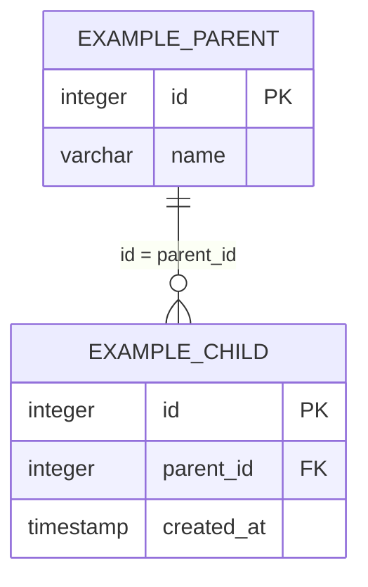

# DB設計: ＜機能名＞

## 概要

この機能が使うスキーマとテーブルの範囲。`requirements.md` の該当 REQ を満たすことだけを書く。

テーブルが無い場合は「テーブルなし」と書き、ER 図とテーブル設計は「なし」とする。ファイルは省略しない。

- スキーマ: `<feature_name>`（kebab-case の機能名を snake_case にしたもの）。機能固有テーブルのみ置く。
- ユーザ・セッション・システム設定は `public` の共通テーブルを使い、機能スキーマに複製しない。

関連ドキュメント:

- 全体設計: `design.md`
- UI設計: `ui-design.md`
- API設計: `api-design.md`

## ER図

テーブルなしの場合は「なし」。

## テーブル設計

テーブルなしの場合は「なし」。

### ＜スキーマ.テーブル名＞

目的: このテーブルが保持するデータの説明。

| カラム | 型 | NULL | 既定 | 説明 |
|--------|-----|------|------|------|
| `id` | integer | NOT NULL | シーケンス | PK |
| `＜列名＞` | ＜型＞ | ＜NULL / NOT NULL＞ | ＜既定または -＞ | ＜説明＞ |

制約:

- 主キー:
- 一意:
- 外部キー:

インデックス:

- 

### ＜スキーマ.テーブル名＞（続く場合）

## 関連

エンティティ間の多重度と、削除時の扱い。テーブルなしの場合は「なし」。

## 要件トレーサビリティ

| 要件 | 設計 |
|------|------|
| REQ-001 | ＜テーブル.列、または テーブルなし＞ |

## 未決事項

-

## 承認

現在の状態: 未承認

| 日時 | 状態 | 変更概要 |
|------|------|----------|
| ＜YYYY-MM-DD HH:mm＞ | 未承認 | 初版 |
