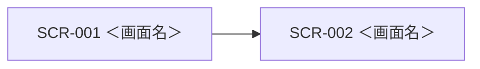

# UI設計: ＜機能名＞

## 概要

この機能の画面構成と、画面毎の部品配置。`requirements.md` の該当 REQ を満たすことだけを書く。

起動・モジュール構成は `design.md`、API の契約は `api-design.md`、テーブル定義は `db-design.md` に書く。

色・余白・部品の見た目、画面分割とナビは `.cursor/rules/15-ui-style.mdc` に従う。コンテンツ領域に置く部品は、この機能の要件に合わせて決める。他機能の画面は参照しない。

画面が無い場合は「画面なし」と書き、共通UI・画面一覧・画面詳細・画面遷移は「なし」とする。ファイルは省略しない。

関連ドキュメント:

- 全体設計: `design.md`
- DB設計: `db-design.md`
- API設計: `api-design.md`

## 共通UI

ヘッダとナビの形は `15-ui-style.mdc`。この機能のナビ項目と、画面間で共用するダイアログなど。殻以外が無い場合は「15 の殻のみ」。

| 部品 | 配置箇所 | 役割 |
|------|----------|------|
| ＜部品名＞ | ＜ヘッダ / フッタ / モーダル 等＞ | ＜役割＞ |

## 画面一覧

| 画面ID | 画面名 | パス | 目的 | 対応 REQ |
|--------|--------|------|------|----------|
| SCR-001 | ＜画面名＞ | `/＜path＞` | ＜役割＞ | REQ-001 |

## 画面詳細

### SCR-001 ＜画面名＞

- パス: `/＜path＞`
- 目的:
- 対応 REQ: REQ-001

#### レイアウト

殻（ヘッダ / ナビ / コンテンツ）は `15-ui-style.mdc`。下表はコンテンツ領域の部品。同じ役割の部品は同ルールの呼び方（主ボタン、一覧、など）を使う。

| 領域 | 部品 | 内容・動作 |
|------|------|------------|
| ヘッダ | 見出し | ＜画面タイトル＞ |
| ヘッダ | 主ボタン | ＜例: 新規＞ |
| メイン | 検索 | ＜任意。プレースホルダ「検索」＞ |
| メイン | 一覧 | ＜列。空のときは「データがありません」＞ |
| フッタ | 副ボタン | ＜例: 戻る＞ |

#### 部品詳細

| 部品 | 必須 | 初期値 | バリデーション | 備考 |
|------|------|--------|----------------|------|
| ＜部品名＞ | 必須 / 任意 / - | ＜値または -＞ | ＜規則または -＞ | ＜プレースホルダ、最大件数 等＞ |

#### 操作

| 操作 | 部品 | 結果 |
|------|------|------|
| ＜操作名＞ | ＜ボタン名＞ | ＜遷移先画面ID、または表示の変化＞ |

#### 状態

| 状態 | 表示 |
|------|------|
| 初期 | ＜＞ |
| 読込中 | ＜＞ |
| 空 | ＜＞ |
| エラー | ＜＞ |

#### レスポンシブ

殻の違いは `15-ui-style.mdc`（PC は左ナビ、スマートフォンは下ナビ。一覧と詳細は PC で同時表示可、スマートフォンは画面遷移）。コンテンツの違いはここに書く。違いが無い場合は「殻は 15、コンテンツは同一」。

### SCR-002 ＜画面名＞（続く場合）

- パス: `/＜path＞`
- 目的:
- 対応 REQ: REQ-002

（以降、SCR-001 と同じ小節）

## 画面遷移

画面なしの場合は「なし」。

| 起点 | 操作 | 条件 | 行き先 |
|------|------|------|--------|
| SCR-001 | ＜操作＞ | ＜条件または なし＞ | SCR-002 |

## 要件トレーサビリティ

| 要件 | 設計 |
|------|------|
| REQ-001 | SCR-001 ＜画面名＞ |

## 未決事項

-

## 承認

現在の状態: 未承認

| 日時 | 状態 | 変更概要 |
|------|------|----------|
| ＜YYYY-MM-DD HH:mm＞ | 未承認 | 初版 |
