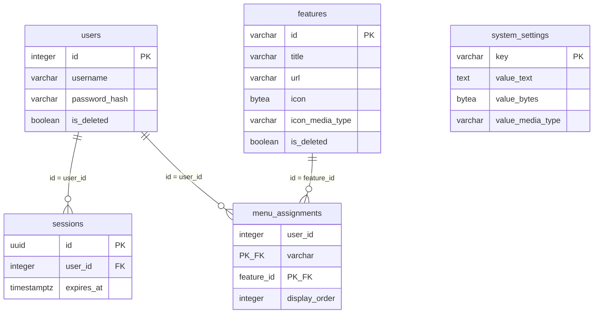

# DB設計: user-management（ユーザ管理）

## 概要

この機能が使うスキーマとテーブルの範囲。`requirements.md` の該当 REQ を満たすことだけを書く。

本機能の固有スキーマは作らない。固有テーブルも作らない。DDL は持たない。ユーザ、セッション、システム設定、機能マスタ、メニュー割当はスキーマ `public` の既存表を読む・更新する。機能スキーマへ複製しない。表の作成と初期データは `portal` が担う。

関連ドキュメント:

- 全体設計: `design.md`
- UI設計: `ui-design.md`
- API設計: `api-design.md`

## ER図

## テーブル設計

列と制約は既存の `public` 表に合わせる。本機能は列を増やさない。

### public.users

目的: ログインに使うユーザ。本機能は未削除の一覧、追加、ユーザ名とパスワードの更新、論理削除を行う。パスワードはハッシュのみ保持する。

| カラム | 型 | NULL | 既定 | 説明 |
|--------|-----|------|------|------|
| `id` | integer | NOT NULL | シーケンス | ユーザID。PK |
| `username` | varchar(255) | NOT NULL | - | ユーザ名。ログインに使う |
| `password_hash` | varchar(255) | NOT NULL | - | パスワードのハッシュ。平文は置かない |
| `is_deleted` | boolean | NOT NULL | false | 論理削除なら true |

制約:

- 主キー: `id`
- 一意: `username`（論理削除済みも含め、同じユーザ名は置けない）
- 外部キー: なし

インデックス:

- `username`（一意制約に付随）

本機能の扱い:

- 一覧は `is_deleted = false` のみ。`password_hash` は API に出さない。
- 追加は `username` とハッシュしたパスワードを挿入する。
- 更新は未削除行の `username` と、指定があるときだけ `password_hash`。
- 削除は `is_deleted = true` にする。自分自身（操作中ユーザの `id`）は更新しない。
- 論理削除時は、そのユーザの `sessions` 行を削除する。

### public.sessions

目的: ログイン状態。本機能は参照のみ（作成・ログアウトはしない）。Cookie のセッション ID でユーザを特定する。

| カラム | 型 | NULL | 既定 | 説明 |
|--------|-----|------|------|------|
| `id` | uuid | NOT NULL | 生成した UUID | セッション ID。PK。Cookie の値 |
| `user_id` | integer | NOT NULL | - | 対象ユーザ。`users.id` |
| `expires_at` | timestamptz | NOT NULL | - | この日時を過ぎたら未ログイン |

制約:

- 主キー: `id`
- 一意: なし
- 外部キー: `user_id` → `public.users.id`（ON DELETE RESTRICT）

インデックス:

- `user_id`
- `expires_at`

本機能の扱い:

- 行が無い、期限切れ、対象ユーザが論理削除済みは未ログイン。
- 利用のたびに `expires_at` を延ばしてよい。期限は `SESSION_TIMEOUT_MINUTES` から算出する。
- ユーザの論理削除時は当該ユーザの行を削除する。セッションの新規作成はしない。

### public.system_settings

目的: 機能をまたいで参照する値。本機能は読むだけ（変更しない）。ログイン URL、メニュー URL、システム共通アイコン。

| カラム | 型 | NULL | 既定 | 説明 |
|--------|-----|------|------|------|
| `key` | varchar(64) | NOT NULL | - | 設定キー。PK |
| `value_text` | text | NULL | - | URL など文字列の値 |
| `value_bytes` | bytea | NULL | - | アイコンのバイナリ。ディスク上のファイルは持たない |
| `value_media_type` | varchar(64) | NULL | - | バイナリのメディアタイプ。文字列の設定では NULL |

制約:

- 主キー: `key`
- 一意: なし
- 外部キー: なし
- 検査: `value_text` と `value_bytes` のうち、ちょうど一方だけが NOT NULL
- 検査: `value_bytes` があるとき `value_media_type` は NOT NULL。`value_text` があるとき `value_media_type` は NULL

インデックス:

- なし（PK のみ）

本機能が読むキー:

| key | 使う列 | 用途 |
|-----|--------|------|
| `login_url` | `value_text` | 未ログイン時の誘導先 |
| `menu_url` | `value_text` | 戻る先 |
| `icon_system` | `value_bytes` + `value_media_type` | ヘッダのシステムアイコン |
| `icon_back` | `value_bytes` + `value_media_type` | ヘッダの戻るアイコン |

`icon_settings` は本機能の画面では使わない。DB には Base64 や data URL としては置かない。

### public.features

目的: 機能マスタ。本機能は未削除の一覧、追加、タイトル・遷移先・アイコンの更新、論理削除を行う。識別子 `user-management` の行は削除しない。

| カラム | 型 | NULL | 既定 | 説明 |
|--------|-----|------|------|------|
| `id` | varchar(64) | NOT NULL | - | 機能ID。運用者が指定する。PK |
| `title` | varchar(255) | NOT NULL | - | メニューに出すタイトル |
| `url` | varchar(2048) | NOT NULL | - | 遷移先 URL |
| `icon` | bytea | NOT NULL | - | 機能を表すアイコンのバイナリ。ディスク上のファイルは持たない |
| `icon_media_type` | varchar(64) | NOT NULL | - | アイコンのメディアタイプ |
| `is_deleted` | boolean | NOT NULL | false | 論理削除なら true |

制約:

- 主キー: `id`
- 一意: なし（PK が識別子）
- 外部キー: なし

インデックス:

- なし（PK のみ）

本機能の扱い:

- 一覧は `is_deleted = false` のみ。
- 追加は `id`・`title`・`url`・`icon`・`icon_media_type` を挿入する。同じ `id` は置けない。
- 更新は未削除行の `title`・`url`、および指定があるとき `icon` と `icon_media_type`。`id` は変えない。
- 削除は `is_deleted = true` にする。`id = 'user-management'` は更新しない。
- 論理削除では割当行を残す。

### public.menu_assignments

目的: ユーザのメニューに載せる機能と表示順。本機能は未削除同士の一覧、追加、行削除（解除）を行う。

| カラム | 型 | NULL | 既定 | 説明 |
|--------|-----|------|------|------|
| `user_id` | integer | NOT NULL | - | 対象ユーザ。`users.id` |
| `feature_id` | varchar(64) | NOT NULL | - | 対象機能。`features.id` |
| `display_order` | integer | NOT NULL | - | 表示順。値が小さいほど先 |

制約:

- 主キー: `(user_id, feature_id)`
- 一意: なし（同じユーザで `display_order` が同じになってよい）
- 外部キー: `user_id` → `public.users.id`（ON DELETE RESTRICT）
- 外部キー: `feature_id` → `public.features.id`（ON DELETE RESTRICT）

インデックス:

- `(user_id, display_order)`

本機能の扱い:

- 一覧は `users.is_deleted = false` かつ `features.is_deleted = false` の行だけ。
- 追加は未削除のユーザと未削除の機能に限り挿入する。同じ `(user_id, feature_id)` は置けない。
- 解除は行を削除する。操作中ユーザの `user_id` かつ `feature_id = 'user-management'` は削除しない。
- 利用可否判定も、未削除のユーザと未削除の機能のときだけ有効とする。

## 関連

- `users` 1 対 多 `sessions`。ユーザを物理削除しない。論理削除時は、そのユーザの `sessions` を削除する。
- `users` 1 対 多 `menu_assignments`。ユーザの論理削除では割当行を残す。
- `features` 1 対 多 `menu_assignments`。機能の論理削除では割当行を残す。
- `system_settings` は他表と結び付けない。本機能は参照のみ。
- 本機能が物理削除するのは、ユーザ論理削除時のセッション行と、割当解除時の `menu_assignments` 行だけである。

## 要件トレーサビリティ

| 要件 | 設計 |
|------|------|
| REQ-001 | `public.sessions`、`public.users`、`public.features`（`id = 'user-management'`）、`public.menu_assignments` |
| REQ-002 | `public.users`（`is_deleted = false`。`password_hash` は出さない） |
| REQ-003 | `public.users` への挿入（`username`, `password_hash`） |
| REQ-004 | `public.users` の `username` / `password_hash` 更新 |
| REQ-005 | `public.users.is_deleted`。自己の `id` は更新しない。当該 `sessions` を削除 |
| REQ-006 | `public.features`（`is_deleted = false`） |
| REQ-007 | `public.features` への挿入 |
| REQ-008 | `public.features` の `title` / `url` / `icon` / `icon_media_type` 更新。`id` は変えない |
| REQ-009 | `public.features.is_deleted`。`id = 'user-management'` は更新しない |
| REQ-010 | `public.menu_assignments` と未削除の `users` / `features` |
| REQ-011 | `public.menu_assignments` への挿入 |
| REQ-012 | `public.menu_assignments` の行削除。自己かつ `feature_id = 'user-management'` は削除しない |
| REQ-013 | テーブルなし（ファイルログ） |

## 未決事項

- なし

## 承認

現在の状態: 承認済み

| 日時 | 状態 | 変更概要 |
|------|------|----------|
| 2026-08-26 22:57 | 未承認 | 初版 |
| 2026-08-26 23:00 | 承認済み | 初版を承認 |
