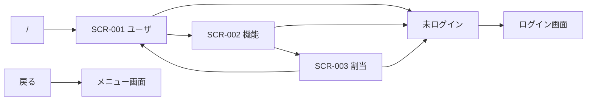

# UI設計: user-management（ユーザ管理）

## 概要

この機能の画面構成と、画面毎の部品配置。`requirements.md` の該当 REQ を満たすことだけを書く。

起動・モジュール構成は `design.md`、API の契約は `api-design.md`、テーブル定義は `db-design.md` に書く。

色・余白・部品の見た目、画面分割とナビは `.cursor/rules/15-ui-style.mdc` に従う。コンテンツ領域に置く部品は、この機能の要件に合わせて決める。他機能の画面は参照しない。`--color-primary` は Violet `#8B7CFF`。

関連ドキュメント:

- 全体設計: `design.md`
- DB設計: `db-design.md`
- API設計: `api-design.md`

## 共通UI

ヘッダとナビの形は `15-ui-style.mdc`。ログイン画面とメニュー画面は持たない。殻を使う。

| 部品 | 配置箇所 | 役割 |
|------|----------|------|
| 戻る | ヘッダ | テキストボタン。戻るアイコンと「戻る」。メニュー画面 URL へ進む。 |
| 見出し | ヘッダ | 現在の画面名（ユーザ / 機能 / 割当）。 |
| システムアイコン | ヘッダ | システム全体を表すアイコン。押しても遷移しない。 |
| ナビ「ユーザ」 | ナビ | SCR-001 へ。現在地を示す。 |
| ナビ「機能」 | ナビ | SCR-002 へ。現在地を示す。 |
| ナビ「割当」 | ナビ | SCR-003 へ。現在地を示す。 |
| 確認ダイアログ | モーダル | 削除または解除の確認。「削除」または「解除」と「キャンセル」。 |

未ログインでいずれかの画面を開いたときは、内容を見せずログイン画面 URL へ進む。本機能が割り当てられていないときは、内容を見せず、コンテンツに「この機能を使えません」と戻る操作だけを示す。

## 画面一覧

| 画面ID | 画面名 | パス | 目的 | 対応 REQ |
|--------|--------|------|------|----------|
| SCR-001 | ユーザ | `/portal_user_management/users` | ユーザの一覧、追加、更新、削除。 | REQ-001, REQ-002, REQ-003, REQ-004, REQ-005 |
| SCR-002 | 機能 | `/portal_user_management/features` | 機能の一覧、追加、更新、削除。 | REQ-001, REQ-006, REQ-007, REQ-008, REQ-009 |
| SCR-003 | 割当 | `/portal_user_management/assignments` | 割当の一覧、追加、解除。 | REQ-001, REQ-010, REQ-011, REQ-012 |

パス `/portal_user_management/` は画面を持たず、SCR-001 へ進む。

## 画面詳細

### SCR-001 ユーザ

- パス: `/portal_user_management/users`
- 目的: 削除されていないユーザを一覧し、追加・更新・削除する。
- 対応 REQ: REQ-001, REQ-002, REQ-003, REQ-004, REQ-005

#### レイアウト

殻（ヘッダ / ナビ / コンテンツ）は `15-ui-style.mdc`。下表はコンテンツ領域の部品。

| 領域 | 部品 | 内容・動作 |
|------|------|------------|
| メイン | エラー | 失敗時、領域先頭に一文。内部理由は出さない。 |
| メイン | 成功 | 保存・削除の成功時、領域先頭に一文。数秒で消す。 |
| メイン | 一覧 | 列はユーザ名、メールアドレス。パスワードは出さない。行を選ぶと編集対象になる。空のときは「データがありません」。 |
| メイン | 主ボタン | 「新規」。追加の入力に切り替える。 |
| メイン | 入力 | ユーザ名。プレースホルダ「ユーザ名」。 |
| メイン | 入力 | メールアドレス。プレースホルダ「メールアドレス」。 |
| メイン | 入力 | パスワード。プレースホルダは追加時「パスワード」、更新時「空なら変更しない」。入力は伏せる。 |
| メイン | 主ボタン | 「保存」。追加または更新を送る。 |
| メイン | 副ボタン | 「キャンセル」。入力を捨て、選択を解除する。 |
| メイン | テキストボタン | 「削除」。確認ダイアログのあと論理削除する。自分自身の行では出さない。 |

ページ全体はスクロールしない。一覧本体だけスクロールする。

#### 部品詳細

| 部品 | 必須 | 初期値 | バリデーション | 備考 |
|------|------|--------|----------------|------|
| 一覧（ユーザ名） | - | 未削除ユーザ | - | パスワードは出さない |
| 一覧（メールアドレス） | - | 未削除ユーザ | - | 空のときは空で出す |
| ユーザ名 | 必須 | 空、または選択行のユーザ名 | 空なら送信しない | プレースホルダ「ユーザ名」 |
| メールアドレス | 必須 | 空、または選択行のメールアドレス | 空、または `@` の前後に文字が無ければ送信しない | プレースホルダ「メールアドレス」 |
| パスワード | 追加は必須、更新は任意 | 空 | 追加で空なら送信しない。更新で空ならパスワードは変えない | 入力は伏せる |
| 主ボタン「新規」 | - | - | - | 読込中は無効 |
| 主ボタン「保存」 | - | - | - | 読込中は無効 |
| 副ボタン「キャンセル」 | - | - | - | 読込中は無効 |
| テキストボタン「削除」 | - | - | - | 自分自身では非表示。読込中は無効 |
| エラー | - | 非表示 | - | 失敗時のみ。詳細理由は出さない |
| 成功 | - | 非表示 | - | 成功時のみ |

#### 操作

| 操作 | 部品 | 結果 |
|------|------|------|
| 新規 | 主ボタン「新規」 | 入力を空にし、追加の入力を出す。 |
| 行を選ぶ | 一覧の行 | そのユーザを編集対象にする。ユーザ名とメールアドレスを入れ、パスワードは空にする。 |
| 保存 | 主ボタン「保存」 | 必須が空、またはメールアドレスの形式が不正なら送信せず、対象欄を示す。成功なら一覧を更新し、入力を閉じる。失敗ならエラーを示し、入力は残す。 |
| キャンセル | 副ボタン「キャンセル」 | 入力を捨て、選択を解除する。 |
| 削除 | テキストボタン「削除」 | 確認ダイアログで「削除」なら論理削除する。「キャンセル」なら何もしない。成功なら一覧から消える。失敗ならエラー。 |
| 確定（Enter） | ユーザ名 / メールアドレス / パスワード | ボタン「保存」と同じ。 |

#### 状態

| 状態 | 表示 |
|------|------|
| 初期 | 一覧取得を開始する。入力は出さない。 |
| 読込中 | 中央に「読み込み中…」。操作は無効。 |
| 空 | 一覧に「データがありません」。新規は可能。 |
| エラー | 領域先頭にエラーメッセージ。操作は可能なら維持。未ログインは表示せずログイン画面へ進む。 |

#### レスポンシブ

殻は 15（PC は左ナビ、スマートフォンは下ナビ）。PC は一覧と入力を同時表示する。スマートフォンは一覧と入力を同時表示せず、新規または行選択で入力へ切り替え、キャンセルで一覧へ戻る。パスは変えない。

### SCR-002 機能

- パス: `/portal_user_management/features`
- 目的: 削除されていない機能を一覧し、追加・更新・削除する。
- 対応 REQ: REQ-001, REQ-006, REQ-007, REQ-008, REQ-009

#### レイアウト

殻（ヘッダ / ナビ / コンテンツ）は `15-ui-style.mdc`。下表はコンテンツ領域の部品。

| 領域 | 部品 | 内容・動作 |
|------|------|------------|
| メイン | エラー | 失敗時、領域先頭に一文。内部理由は出さない。 |
| メイン | 成功 | 保存・削除の成功時、領域先頭に一文。数秒で消す。 |
| メイン | 一覧 | 列はアイコン、識別子、タイトル。行を選ぶと編集対象になる。空のときは「データがありません」。 |
| メイン | 主ボタン | 「新規」。追加の入力に切り替える。 |
| メイン | 入力 | 識別子。追加時のみ入力可。更新時は表示のみ。プレースホルダ「識別子」。 |
| メイン | 入力 | タイトル。プレースホルダ「タイトル」。 |
| メイン | 入力 | 遷移先。プレースホルダ「遷移先」。 |
| メイン | 入力 | アイコン。画像ファイルを選ぶ。追加時は必須。更新時は未選択なら既存を維持する。選んだ内容は画像として示す。 |
| メイン | 主ボタン | 「保存」。追加または更新を送る。 |
| メイン | 副ボタン | 「キャンセル」。入力を捨て、選択を解除する。 |
| メイン | テキストボタン | 「削除」。確認ダイアログのあと論理削除する。本機能（識別子 `user-management`）の行では出さない。 |

ページ全体はスクロールしない。一覧本体だけスクロールする。アイコン用のファイルをディスク上の配信先には置かない。

#### 部品詳細

| 部品 | 必須 | 初期値 | バリデーション | 備考 |
|------|------|--------|----------------|------|
| 一覧 | - | 未削除機能 | - | アイコンはデータとして得た画像 |
| 識別子 | 追加は必須 | 空、または選択行の識別子 | 追加で空なら送信しない | 更新時は変えられない |
| タイトル | 必須 | 空、または選択行のタイトル | 空なら送信しない | プレースホルダ「タイトル」 |
| 遷移先 | 必須 | 空、または選択行の遷移先 | 空なら送信しない | プレースホルダ「遷移先」 |
| アイコン | 追加は必須、更新は任意 | なし、または選択行の画像 | 追加で未選択なら送信しない | 配信用ファイルは置かない |
| 主ボタン「新規」 | - | - | - | 読込中は無効 |
| 主ボタン「保存」 | - | - | - | 読込中は無効 |
| 副ボタン「キャンセル」 | - | - | - | 読込中は無効 |
| テキストボタン「削除」 | - | - | - | 本機能の行では非表示。読込中は無効 |
| エラー | - | 非表示 | - | 失敗時のみ |
| 成功 | - | 非表示 | - | 成功時のみ |

#### 操作

| 操作 | 部品 | 結果 |
|------|------|------|
| 新規 | 主ボタン「新規」 | 入力を空にし、追加の入力を出す。識別子は入力可。 |
| 行を選ぶ | 一覧の行 | その機能を編集対象にする。識別子は表示のみ。 |
| 保存 | 主ボタン「保存」 | 必須が空なら送信せず、対象欄を示す。成功なら一覧を更新し、入力を閉じる。失敗ならエラーを示し、入力は残す。 |
| キャンセル | 副ボタン「キャンセル」 | 入力を捨て、選択を解除する。 |
| 削除 | テキストボタン「削除」 | 確認ダイアログで「削除」なら論理削除する。「キャンセル」なら何もしない。 |

#### 状態

| 状態 | 表示 |
|------|------|
| 初期 | 一覧取得を開始する。入力は出さない。 |
| 読込中 | 中央に「読み込み中…」。操作は無効。 |
| 空 | 一覧に「データがありません」。新規は可能。 |
| エラー | 領域先頭にエラーメッセージ。操作は可能なら維持。未ログインは表示せずログイン画面へ進む。 |

#### レスポンシブ

殻は 15。PC は一覧と入力を同時表示する。スマートフォンは一覧と入力を同時表示せず、新規または行選択で入力へ切り替え、キャンセルで一覧へ戻る。パスは変えない。

### SCR-003 割当

- パス: `/portal_user_management/assignments`
- 目的: 未削除ユーザへの未削除機能の割当を一覧し、追加・解除する。
- 対応 REQ: REQ-001, REQ-010, REQ-011, REQ-012

#### レイアウト

殻（ヘッダ / ナビ / コンテンツ）は `15-ui-style.mdc`。下表はコンテンツ領域の部品。

| 領域 | 部品 | 内容・動作 |
|------|------|------------|
| メイン | エラー | 失敗時、領域先頭に一文。内部理由は出さない。 |
| メイン | 成功 | 割当・解除の成功時、領域先頭に一文。数秒で消す。 |
| メイン | 一覧 | 列はユーザ名、機能タイトル、表示順。空のときは「データがありません」。 |
| メイン | 主ボタン | 「新規」。追加の入力に切り替える。 |
| メイン | 入力 | ユーザ。未削除ユーザから選ぶ。 |
| メイン | 入力 | 機能。未削除機能から選ぶ。 |
| メイン | 入力 | 表示順。プレースホルダ「表示順」。 |
| メイン | 主ボタン | 「保存」。割当を追加する。 |
| メイン | 副ボタン | 「キャンセル」。入力を捨てる。 |
| メイン | テキストボタン | 「解除」。確認ダイアログのあと割当を外す。自分自身かつ本機能の行では出さない。 |

ページ全体はスクロールしない。一覧本体だけスクロールする。

#### 部品詳細

| 部品 | 必須 | 初期値 | バリデーション | 備考 |
|------|------|--------|----------------|------|
| 一覧 | - | 未削除同士の割当 | - | ユーザ名、機能タイトル、表示順 |
| ユーザ | 必須 | 未選択 | 未選択なら送信しない | 未削除ユーザから選ぶ |
| 機能 | 必須 | 未選択 | 未選択なら送信しない | 未削除機能から選ぶ |
| 表示順 | 必須 | 空 | 空なら送信しない | プレースホルダ「表示順」。整数 |
| 主ボタン「新規」 | - | - | - | 読込中は無効 |
| 主ボタン「保存」 | - | - | - | 読込中は無効 |
| 副ボタン「キャンセル」 | - | - | - | 読込中は無効 |
| テキストボタン「解除」 | - | - | - | 自分自身かつ本機能では非表示。読込中は無効 |
| エラー | - | 非表示 | - | 失敗時のみ |
| 成功 | - | 非表示 | - | 成功時のみ |

#### 操作

| 操作 | 部品 | 結果 |
|------|------|------|
| 新規 | 主ボタン「新規」 | 入力を空にし、追加の入力を出す。 |
| 保存 | 主ボタン「保存」 | 必須が空なら送信せず、対象欄を示す。成功なら一覧を更新し、入力を閉じる。失敗ならエラーを示し、入力は残す。 |
| キャンセル | 副ボタン「キャンセル」 | 入力を捨てる。 |
| 解除 | テキストボタン「解除」 | 確認ダイアログで「解除」なら外す。「キャンセル」なら何もしない。 |

#### 状態

| 状態 | 表示 |
|------|------|
| 初期 | 一覧取得を開始する。入力は出さない。 |
| 読込中 | 中央に「読み込み中…」。操作は無効。 |
| 空 | 一覧に「データがありません」。新規は可能。 |
| エラー | 領域先頭にエラーメッセージ。操作は可能なら維持。未ログインは表示せずログイン画面へ進む。 |

#### レスポンシブ

殻は 15。PC は一覧と入力を同時表示する。スマートフォンは一覧と入力を同時表示せず、新規で入力へ切り替え、キャンセルで一覧へ戻る。パスは変えない。

## 画面遷移

| 起点 | 操作 | 条件 | 行き先 |
|------|------|------|--------|
| `/portal_user_management/` | 開く | なし | SCR-001 |
| SCR-001 | ナビ「機能」 | なし | SCR-002 |
| SCR-001 | ナビ「割当」 | なし | SCR-003 |
| SCR-002 | ナビ「ユーザ」 | なし | SCR-001 |
| SCR-002 | ナビ「割当」 | なし | SCR-003 |
| SCR-003 | ナビ「ユーザ」 | なし | SCR-001 |
| SCR-003 | ナビ「機能」 | なし | SCR-002 |
| いずれか | 開く | 未ログイン | ログイン画面 URL |
| いずれか | 戻る | なし | メニュー画面 URL |
| SCR-001 | 保存 / 削除 / キャンセル | なし | SCR-001（残留） |
| SCR-002 | 保存 / 削除 / キャンセル | なし | SCR-002（残留） |
| SCR-003 | 保存 / 解除 / キャンセル | なし | SCR-003（残留） |

## 要件トレーサビリティ

| 要件 | 設計 |
|------|------|
| REQ-001 | 共通UIの未ログイン誘導と権限なし表示。各画面 |
| REQ-002 | SCR-001 の一覧（ユーザ名とメールアドレス） |
| REQ-003 | SCR-001 の新規と保存。メールアドレス入力 |
| REQ-004 | SCR-001 の行選択と保存。メールアドレス入力 |
| REQ-005 | SCR-001 の削除。自分自身はボタンを出さない |
| REQ-006 | SCR-002 の一覧 |
| REQ-007 | SCR-002 の新規と保存 |
| REQ-008 | SCR-002 の行選択と保存 |
| REQ-009 | SCR-002 の削除。本機能はボタンを出さない |
| REQ-010 | SCR-003 の一覧 |
| REQ-011 | SCR-003 の新規と保存 |
| REQ-012 | SCR-003 の解除。自分自身かつ本機能はボタンを出さない |
| REQ-013 | 画面対象外（ログ） |

## 未決事項

- なし

## 承認

現在の状態: 承認済み

| 日時 | 状態 | 変更概要 |
|------|------|----------|
| 2026-08-26 22:54 | 未承認 | 初版 |
| 2026-08-26 22:57 | 承認済み | 初版を承認 |
| 2026-08-29 18:21 | 未承認 | 公開パスを `/portal_user_management/` 配下にする |
| 2026-08-29 19:19 | 承認済み | 公開パス `/portal_user_management/` の改訂を承認 |
| 2026-08-30 08:24 | 未承認 | ユーザ一覧にメールアドレス列。登録・編集にメールアドレス入力。空と形式不正は送らない |
| 2026-08-30 08:24 | 承認済み | ユーザ一覧と登録・編集のメールアドレスを承認 |
